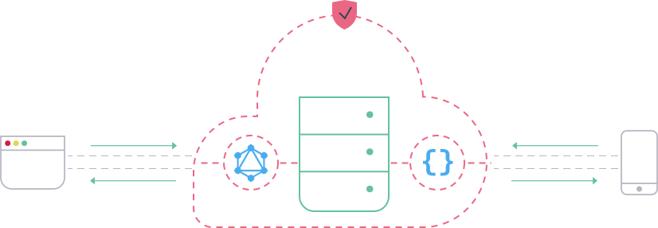
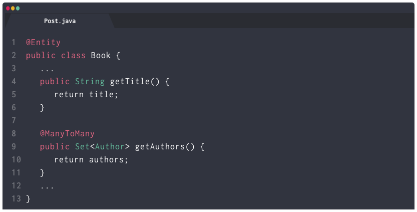
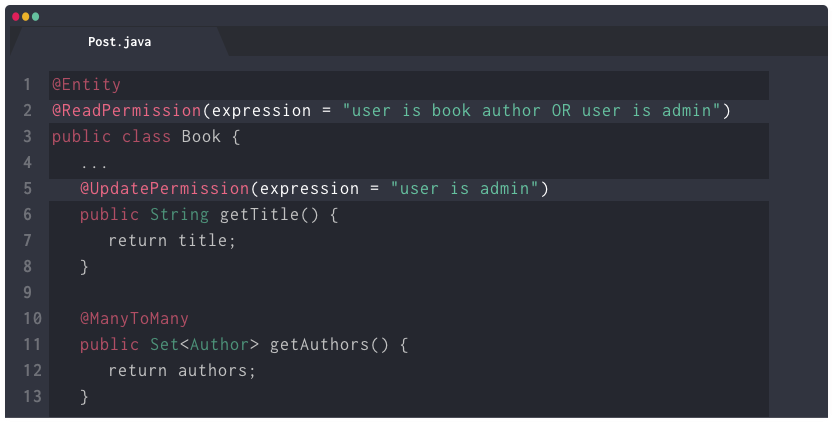
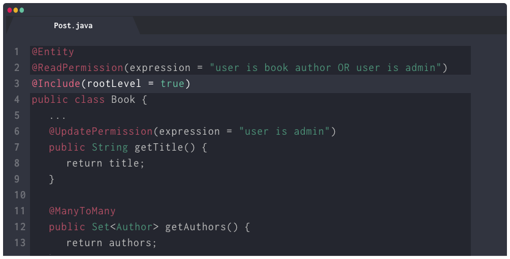
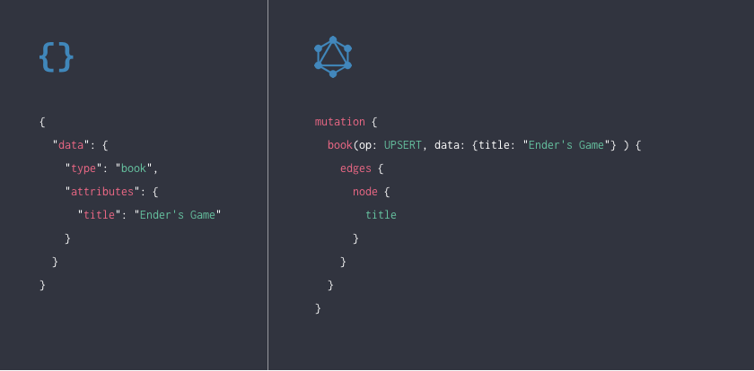

  

    

      <h2>Stand up {json:api} & GraphQL web services backed by JPA annotated models in 4 simple steps</h2>
      <a href="/pages/guide/01-start.html">
        <button type="button" class="btn btn-primary text-light my-3">Get Started</button>
      </a>
      

        
      

    

  

  
  <h4 class="mx-2">Elide is a Java library that enables you to stand up a JSON API or GraphQL web service with minimal effort starting from a JPA annotated data model.</h4>

  
How to use it

  

    

      

        <h4>1. Define a model</h4>
        
Define a JPA annotated model including relationships to other models using Java, Kotlin, Groovy, and other JVM languages.

      

    

    

      
    

  

  

    

      

        <h4>2. Secure It</h4>
        
Control access to fields and entities through a declarative, intuitive permission syntax.

      

    

    

      
    

  

  

    

      

        <h4>3. Expose It</h4>
        
Make instances of your new model accessible through a top level collection or restrict access only through relationships to other models

      

    

    

      
    

  

  

    

      

        <h4>4. Deploy & Query</h4>
        
And thats it, you are ready to deploy and query your data with JSON or GraphQL request.

      

    

    

      
    

  

  

    <h2>Wanna learn more?</h2>
    <a href="/pages/guide/01-start.html">
      <button type="button" class="btn btn-primary text-light mb-2">Documentation</button>
    </a>
    
Or see our features below

  

  

    
Features

    

      

        <h4>Production Quality</h4>
        
Quickly build and deploy production quality web services that expose your data as a service.

      

      

        
      

    

    

      

      

      

    

    

      

        
      

      

        <h4>Security Comes Standard</h4>
        
Controlling access to your data is as simple as defining your rules and annotating your models.

      

    

    

      

      

      

    

    

      

        <h4>Mobile Friendly</h4>
        
JSON-API & GraphQL lets developers fetch entire object graphs in a single round trip. Only requested elements of the data model are returned.

      

      

        
      

    

    

      

      

      

    

    

      

        
      

      

        <h4>Single Atomic Request</h4>
        
Elide supports multiple data model mutations in a single request in either JSON-API or GraphQL. Create objects, add them to relationships, modify or delete together in a single atomic request.

      

    

    

      

      

      

    

    

      

        <h4>Elide is Agnostic</h4>
        
Elide is agnostic to your particular persistence strategy. Use an ORM or provide your own implementation of a data store.

      

      

        
      

    

    

      

      

      

    

    

      

        
      

      

        <h4>Open API</h4>
        
Explore, understand, and compose queries against your Elide API through generated <a>Swagger</a> documentation or GraphQL schema.

      

    

    

      

      

      

    

    

      

        <h4>Customize</h4>
        
Customize the behavior of data model operations with computed attributes, data validation annotations, and request lifecycle hooks.

      

      

        
      

    

    

      

      

      

    

    

      

        
      

      

        <h4>Open Source</h4>
        
Elide is 100% open source and available on <a href="https://github.com/yahoo/elide">Github</a>. Released under the commercial-friendly <a href="/pages/license.html">Apache License, Version 2.0</a>.

      

    

  

  <h2>Opinionated APIs for web & mobile</h2>
  
Improve the velocity and quality of your team's work.

  <a href="/pages/guide/01-start.html">
    <button type="button" class="btn btn-primary text-light">Get Started</button>
  </a>

  

    

      

        
      

      

        <a href="/pages/guide/01-start.html">Documentation</a>
        <a href="/pages/license.html">Licensing</a>
      

      

        <a href="https://github.com/yahoo/elide/releases">Releases</a>
        <a href="https://gitter.im/yahoo/elide">Gitter Chat</a>
      

      

        <a href="https://github.com/yahoo/elide">
          <button type="button" class="btn btn-secondary github">
            
            Github
          </button>
        </a>
      

    

  

